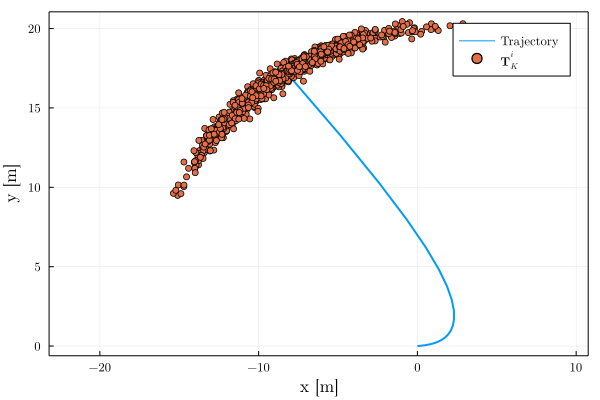

# In this repo
The repository includes an example of propagating poses through SE(2) process model and demonstrates how to compute a first-order uncertainty bound.

The script heavily follows [this MATLAB script](https://github.com/UMich-CURLY-teaching/UMich-ROB-530-public/blob/main/code-examples/MATLAB/matrix_groups/odometry_propagation_se2.m) by [UMich-CURLY-teaching](https://github.com/UMich-CURLY-teaching).

