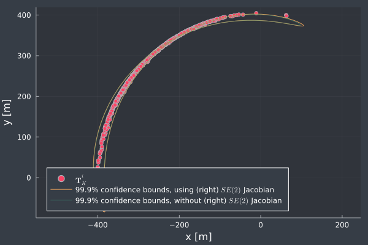

# In this repo
The repository includes an example of propagating poses through SE(2) process model and demonstrates how to compute a first-order uncertainty bound.

The script heavily follows [this MATLAB script](https://github.com/UMich-CURLY-teaching/UMich-ROB-530-public/blob/main/code-examples/MATLAB/matrix_groups/odometry_propagation_se2.m) by [UMich-CURLY-teaching](https://github.com/UMich-CURLY-teaching).

# Generated plots
## Umbrella plot without covariance

## Trajectory with covariance

## Long trajectory with confidence bounds
Note that for longer trajectories, the confidence bounds are no longer consistent.
This may be due to simplified Jacobian computations (e.g., the left/right Jacobians are *not* used).

## Confidence bounds with and without (right) Jacobians
As can be seen here, the effect is minimal for the presented example.
Note that the effects may be more substantion for different examples.

